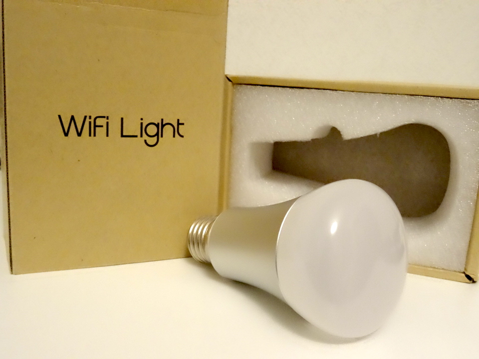
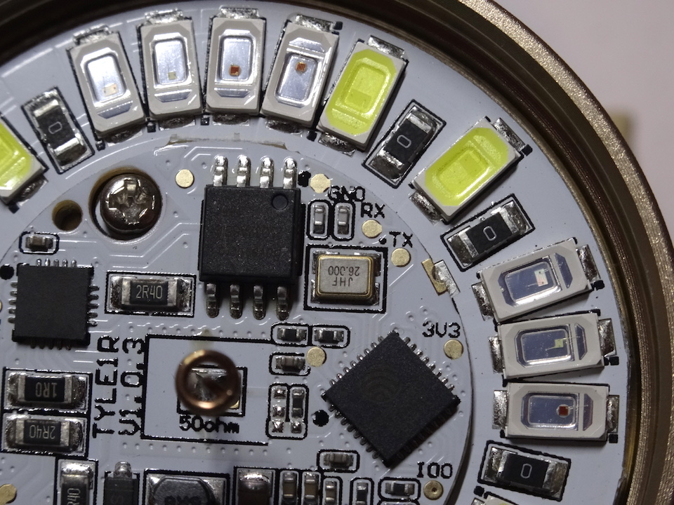

# Alternative firmware for AI-Thinker RGBW bulbs

This is an alternative firmware for AI-Thinker RGBW LED bulbs which uses MQTT instead of the default Chinese mobile application. The bulb is a cheap (~12-18$) product available on sites like Aliexpress and eBay which can be easily reprogrammed as it is based on the popular ESP8266 Wi-Fi chip.



## Features
- Remote control over the MQTT protocol via JSON
  - Supports brightness, RGB and white colors, color temperature and effects
- TLS support (uncomment `#define TLS` in `config.h` and change the fingerprint if not using CloudMQTT)
- Debug printing over Telnet or Serial (uncomment `#define DEBUG_TELNET` or `#define DEBUG_SERIAL` in `config.h`)
- ArduinoOTA support for over-the-air firmware updates (enabled, `#define OTA` in `config.h`)
- Native support for Home Assistant, including MQTT discovery (enabled, `#define MQTT_HOME_ASSISTANT_SUPPORT` in `config.h`)

### Last Will and Testament

The firmware will publish a *MQTT Last Will and Testament* at `<chipID>/rgbw/status`.
When the device successfully connects it will publish `alive` to that topic and when it disconnects `dead` will automatically be published.

### Discovery

This firmware supports *Home Assistant's MQTT discovery functionality*, added in 0.40.
This allows for instant setup and use of your device without requiring any manual configuration in Home Assistant.
To get this working, `discovery: true` must be defined in your `mqtt` configuration in Home Assistant

*configuration.yaml*

```yaml
mqtt:
  broker: 'm21.cloudmqtt.com'
  username: '[REDACTED]'
  password: '[REDACTED]'
  port: '[REDACTED]'
  discovery: true
```

## How to
1. Install the [Arduino IDE](https://www.arduino.cc/en/Main/Software) and the [ESP8266 core for Arduino](https://github.com/esp8266/Arduino)
2. Rename `config.example.h`to `config.h`
3. Define your WiFi SSID and password (`#define WIFI_SSID "<SSID>"`and `#define WIFI_PASSWORD "<password>"`in `config.h`)
4. Define your MQTT settings (`#define MQTT_USERNAME "<username>"`, `#define MQTT_PASSWORD "<password>"`, `#define MQTT_SERVER "<server>"` and `#define MQTT_SERVER_PORT <port>`)
5. Install the external libraries ([PubSubClient](https://github.com/knolleary/pubsubclient), [ArduinoJson](https://github.com/bblanchon/ArduinoJson) and [my9291](https://github.com/xoseperez/my9291))
5. Define `MQTT_MAX_PACKET_SIZE` to `512`instead of `128`in `Arduino/libraries/pubsubclient/src/PubSubClient.h`
6. Solder wires from (bulb) `3V3` to `3V3` (FTDI), `GND` to `GND`, `RX` to `TX`, `TX` to `RX` and `ÌO0` to `GND`
7. Flash the firmware (board `Generic ESP8266 module`, Upload Speed `115200` and Flash Size `1M (128K SPIFFS)`)



## ToDo
- [Transitions](https://home-assistant.io/components/light.mqtt_json/)
- [Flash mode](https://home-assistant.io/components/light.mqtt_json/)
- [Individual MQTT topics](https://home-assistant.io/components/light.mqtt/) instead of JSON
- More effects
- [WiFiManager](https://github.com/tzapu/WiFiManager)

## Licence
> THE SOFTWARE IS PROVIDED "AS IS", WITHOUT WARRANTY OF ANY KIND, EXPRESS OR
  IMPLIED, INCLUDING BUT NOT LIMITED TO THE WARRANTIES OF MERCHANTABILITY,
  FITNESS FOR A PARTICULAR PURPOSE AND NONINFRINGEMENT. IN NO EVENT SHALL THE
  AUTHORS OR COPYRIGHT HOLDERS BE LIABLE FOR ANY CLAIM, DAMAGES OR OTHER
  LIABILITY, WHETHER IN AN ACTION OF CONTRACT, TORT OR OTHERWISE, ARISING FROM,
  OUT OF OR IN CONNECTION WITH THE SOFTWARE OR THE USE OR OTHER DEALINGS IN THE
  SOFTWARE.

*If you like the content of this repo, please add a star! Thank you!*
