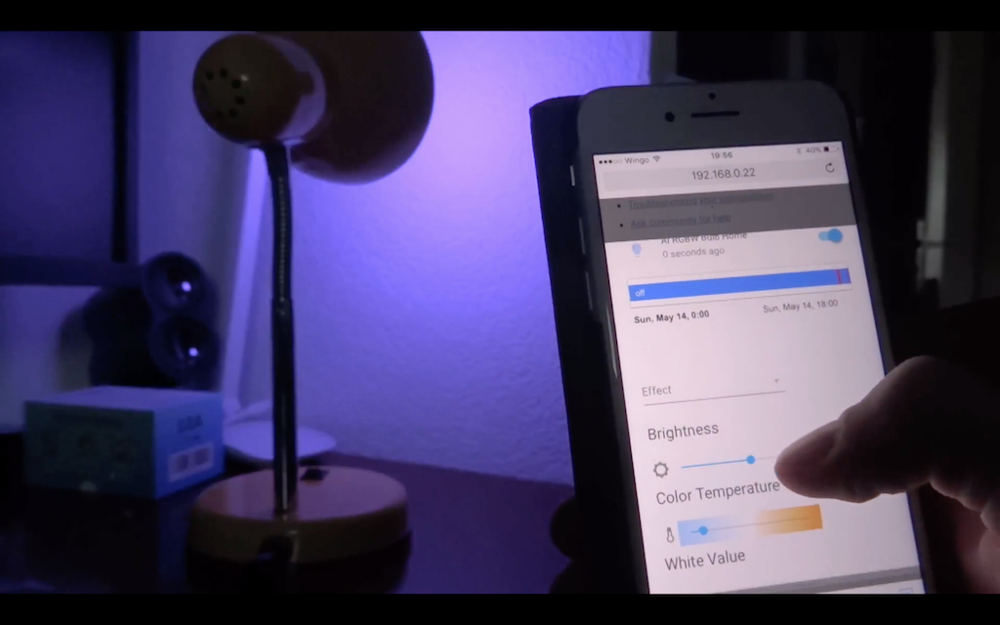

# Alternative firmware for AI-Thinker RGBW bulbs

This is an alternative firmware for AI-Thinker RGBW LED bulbs, which uses MQTT instead of the default Chinese mobile application. The bulb is a cheap (~12-18$) product available on sites like Aliexpress ([here](https://www.aliexpress.com/item/DIY-Wifi-LED-Bulb-E27-5W-AC110-240V-lampada-LED-Dimmable-Bulb-Lamp-Remote-Control-Led/32740055347.html?spm=2114.10010108.1000013.4.P25xWH&scm=1007.13339.33317.0&pvid=7153dc2f-cf5f-4aae-904a-0bbea7dd8130&tpp=1&aff_platform=link-c-tool&cpt=1494357650729&sk=ybuVN3n&aff_trace_key=36cdbdb111d04acf9cc7acdb2f38f2a8-1494357650729-08203-ybuVN3n)) and eBay ([here](http://www.ebay.com/itm/Noduino-Open-Light-LED-Smart-Bulb-Color-E27-7W-WiFi-ESP8266-MQTT-/222491267554?rmvSB=true) or [here](http://www.ebay.com/itm/2pcs-Lot-Noduino-Open-Light-LED-Smart-Bulb-Color-E27-7W-WiFi-ESP8266-MQTT-/222486566367?&rmvSB=true)), which can be easily reprogrammed as it is based on the popular ESP8266 Wi-Fi chip.


## Features
- Remote control over the MQTT protocol via JSON
  - Supports brightness, RGB and white colors, color temperature and effects
- TLS support (uncomment `#define TLS` in `config.h` and change the fingerprint if not using CloudMQTT)
- Debug printing over Telnet or Serial (uncomment `#define DEBUG_TELNET` or `#define DEBUG_SERIAL` in `config.h`)
- ArduinoOTA support for over-the-air firmware updates (enabled, `#define OTA` in `config.h`)
- Native support for Home Assistant, including MQTT discovery (enabled, `#define MQTT_HOME_ASSISTANT_SUPPORT` in `config.h`)
- Store the current state of the bulb in memory to prevent from losing its state in case of power cut (enabled, `#define SAVE_STATE` in `config.h`)
- [Gamma correction](https://learn.adafruit.com/led-tricks-gamma-correction/the-issue) (enabled, `#define GAMMA_CORRECTION` in `config.h`)

## Demonstration

[](https://www.youtube.com/watch?v=xIR5uHMbAZ4 "Home Assistant + MQTT + 10$ RGBW Bulb")

### Last Will and Testament

The firmware will publish a *MQTT Last Will and Testament* at `<chipID>/rgbw/status`.
When the device successfully connects it will publish `alive` to that topic and when it disconnects, `dead` will automatically be published.

### Discovery

This firmware supports *Home Assistant's MQTT discovery functionality*, added in 0.40.
This allows for instant setup and use of your device without requiring any manual configuration in Home Assistant.
To get this working, `discovery: true` must be defined in your `mqtt` configuration in Home Assistant

*configuration.yaml*

```yaml
mqtt:
  broker: 'm21.cloudmqtt.com'
  username: '[REDACTED]'
  password: '[REDACTED]'
  port: '[REDACTED]'
  discovery: true
```

### MQTT JSON Light
This firmware supports on/off, brightness, RGB colors, color temperature, white values and effects. The messages sent to/from the light look similar to the example below, omitting fields when they aren’t needed.

```yaml
{
  "brightness": 255,
  "color_temp": 155,
  "color": {
    "r": 255,
    "g": 255,
    "b": 255,
  },
  "effect": "Rainbow",
  "state": "ON",
  "white_value": 150
}
```

| Name          | Data Type | Values       | Description
|---------------|-----------|--------------|------------------------------------------------------------|
| `brightness`  | Integer   | 0-255        | The brightness to set to                                   |
| `color`       | Object    | -            | A dictionary with the below RGB values                     |
| `color.r`     | Integer   | 0-255        | The red color to set to                                    |
| `color.g`     | Integer   | 0-255        | The green color to set to                                  |
| `color.b`     | Integer   | 0-255        | The blue color to set to                                   |
| `state`       | String    | ON/OFF       | The state of the light to set to                           |
| `white_value` | Integer   | 0-255        | The white color to set to                                  |
| `effect`      | String    | Rainbow/Blink| The effect to set to                                       |
| `color_temp`  | Integer   | 154-500      | The color temperature to set to                            |

## How to
1. Install the [Arduino IDE](https://www.arduino.cc/en/Main/Software) and the [ESP8266 core for Arduino](https://github.com/esp8266/Arduino)
2. Rename `config.example.h`to `config.h`
3. Define your WiFi SSID and password (`#define WIFI_SSID "<SSID>"`and `#define WIFI_PASSWORD "<password>"`in `config.h`)
4. Define your MQTT settings (`#define MQTT_USERNAME "<username>"`, `#define MQTT_PASSWORD "<password>"`, `#define MQTT_SERVER "<server>"` and `#define MQTT_SERVER_PORT <port>`)
5. Install the external libraries ([PubSubClient](https://github.com/knolleary/pubsubclient), [ArduinoJson](https://github.com/bblanchon/ArduinoJson) and [my9291](https://github.com/xoseperez/my9291))
5. Define `MQTT_MAX_PACKET_SIZE` to `512`instead of `128`in `Arduino/libraries/pubsubclient/src/PubSubClient.h`
6. Solder wires from (bulb) `3V3` to `3V3` (FTDI), `GND` to `GND`, `RX` to `TX`, `TX` to `RX` and `ÌO0` to `GND`
7. Flash the firmware (board `Generic ESP8266 module`, Upload Speed `115200` and Flash Size `1M (128K SPIFFS)`)

**FOR SECURITY REASONS, IT'S HIGHLY RECOMMENDED TO HAVE A STRONG WI-FI PASSWORD, TO ENABLE TLS, TO DEACTIVATE THE DEBUGGING OUTPUT AND TO SET A PASSWORD FOR OTA.**


## Licence
> THE SOFTWARE IS PROVIDED "AS IS", WITHOUT WARRANTY OF ANY KIND, EXPRESS OR
  IMPLIED, INCLUDING BUT NOT LIMITED TO THE WARRANTIES OF MERCHANTABILITY,
  FITNESS FOR A PARTICULAR PURPOSE AND NONINFRINGEMENT. IN NO EVENT SHALL THE
  AUTHORS OR COPYRIGHT HOLDERS BE LIABLE FOR ANY CLAIM, DAMAGES OR OTHER
  LIABILITY, WHETHER IN AN ACTION OF CONTRACT, TORT OR OTHERWISE, ARISING FROM,
  OUT OF OR IN CONNECTION WITH THE SOFTWARE OR THE USE OR OTHER DEALINGS IN THE
  SOFTWARE.

*This firmware was graciously supported by [DariBer](https://github.com/DariBer), who had offered me a development bulb. If you like the content of this repo, please add a star! Thank you!*
